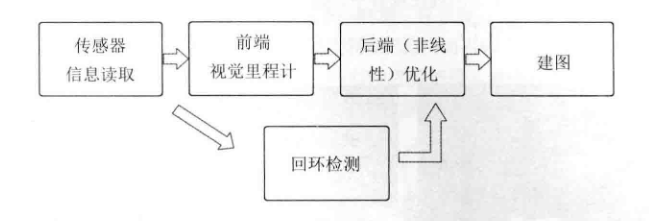

# Vslam
Simultaneous Localization and Mapping
同时定位和地图构建

$$
\begin{equation}
\frac{f}{v - f} = \frac{u}{v} 
\end{equation}
$$

### VSLAM框架

- 1.**传感器信息读取**。在视觉SLAM中主要为相机图像信息的读取和预处理。如果是在机器人中，还可能有码盘、惯性传感器等信息的读取和同步。
- 2.**前端视觉里程计(VisualOdometry，VO)**。视觉里程计的任务是估算相邻图像间相机的运动，以及局部地图的样子。VO又称为前端(Front End)。
- 3.**后端(非线性)优化(Optimization)**。后端接受不同时刻视觉里程计测量的相机位姿，以及回环检测的信息，对它们进行优化，得到全局一致的轨迹和地图。由于接在 VO之后又称为后端(Back End)
- 4.**回环检测(LoopClosure Detection)**。回环检测判断机器人是否到达过先前的位置。如果检测到回环，它会把信息提供给后端进行处理
- 5.**建图(Mapping)**。它根据估计的轨迹，建立与任务要求对应的地图

### ch3
$$
\begin{equation}
e^{i\theta}=cos\theta+isin\theta 
\end{equation}
$$

$$
\begin{equation}
q = q_0+q_1i+q_2j+q_3k
\end{equation}
$$

$$
\left\{
\begin{align}
&i^2=j^2=k^2 \nonumber\\
&ij=k,ji=-k     \nonumber \\  
&jk=i,kj=-i \nonumber  \\
&ki=j,ik=-j \nonumber  \\
\end{align}
\right.
$$
